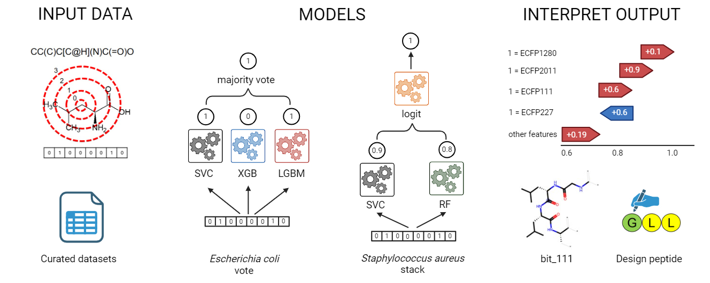

# ecosa

This is the repository for the codes of vote and stack models in the paper, [Interpretable ensemble classifiers for reliable prediction of antibacterial activities of peptides against *Escherichia coli* and *Staphylococcus aureus*](https://ssrn.com/abstract=4736138).



## Dependencies: 

Packages required to run the Google Colab notebook:
- [Python 3.10](https://www.python.org/downloads/release/python-3100/)
- [pyforest 1.1.0](https://pypi.org/project/pyforest/)
- [pca 2.0.5](https://github.com/erdogant/pca/tree/master)
- [deepchem 2.7.1](https://github.com/deepchem/deepchem)
- [shap 0.44.1](https://github.com/shap/shap/tree/master) 

## Colab notebooks:

- [ecoli](https://github.com/mersalas/ecosa/blob/main/ecoli.ipynb) and [saureus](https://github.com/mersalas/ecosa/blob/main/saureus.ipynb): contain the codes used in the model development 
- [ecoli_test](https://github.com/mersalas/ecosa/blob/main/ecoli_test.ipynb): codes for vote model; data can be replaced with your own to make peptide activity prediction and important feature identification
- [saureus_test](https://github.com/mersalas/ecosa/blob/main/saureus_test.ipynb): codes for stack model
- [ecoli_uhl_test](https://github.com/mersalas/ecosa/blob/main/ecoli_uhl_test.ipynb): codes for the model used in the paper, [Enhancing the antibacterial activities of ultrashort histidine-based lipopeptides by selecting an optimum cationic side chain with the aid of computational methods](https://ssrn.com/abstract=4710010)

## How to cite:
```bibtex
@unpublished{Salas2024,
author = {Salas, Remmer and Sabido, Portia Mahal G. and Nellas, Ricky},
journal = {SSRN Electronic Journal},
doi = {10.2139/ssrn.4736138},
title = {{Interpretable ensemble classifiers for reliable prediction of antibacterial activities of peptides against Escherichia coli and Staphylococcus aureus}},
url = {https://www.ssrn.com/abstract=4736138},
year = {2024}
}

@unpublished{Salas2024,
author = {Salas, Remmer L. and Nellas, Ricky B. and Sabido, Portia Mahal G.},
journal = {SSRN Electronic Journal},
doi = {10.2139/ssrn.4710010},
title = {{Enhancing the antibacterial activities of ultrashort histidine-based lipopeptides by selecting an optimum cationic side chain with the aid of computational methods}},
url = {https://ssrn.com/abstract=4710010},
year = {2024}
}

